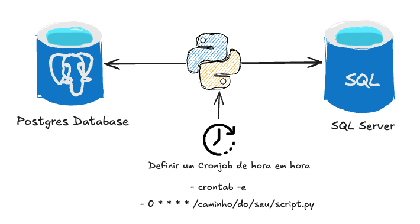

## Carga Incremental de Dados com Python

Esse é um projeto simples, mas com um conceito muito importante que é a atualização incremental dos dados. Ou seja, primeiro fazemos uma carga inteira na tabela de destino e após isso, passamos apenas a acrescentar os dados novos.

A abordagem utilizada nesse código foi a de comparação de chaves da tabela de origem com a tabela de destino para assim carregar os dados recentes. 

